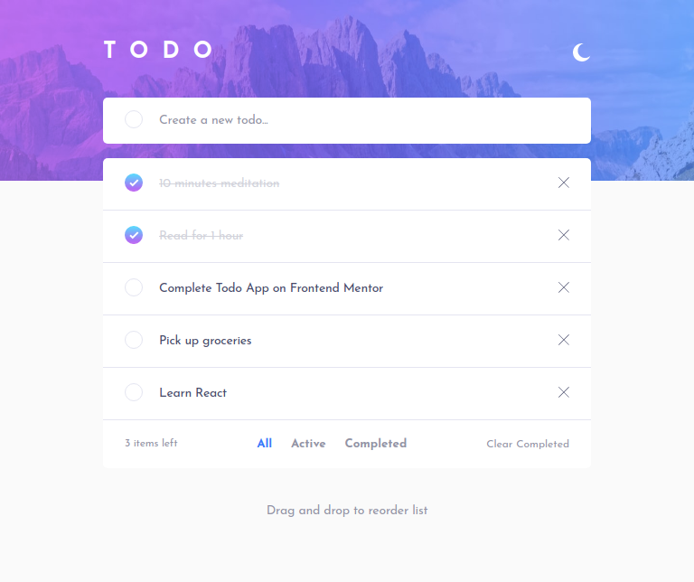

# Frontend Mentor - Todo app solution

This is a solution to the [Todo app challenge on Frontend Mentor](https://www.frontendmentor.io/challenges/todo-app-Su1_KokOW). Frontend Mentor challenges help you improve your coding skills by building realistic projects. 

## Table of contents

- [Frontend Mentor - Todo app solution](#frontend-mentor---todo-app-solution)
  - [Table of contents](#table-of-contents)
  - [Overview](#overview)
    - [The challenge](#the-challenge)
    - [Screenshot](#screenshot)
    - [Links](#links)
  - [My process](#my-process)
    - [Built with](#built-with)
    - [What I learned](#what-i-learned)
    - [Continued development](#continued-development)
    - [Useful resources](#useful-resources)
  - [Author](#author)

## Overview

### The challenge

Users should be able to:

- [x] View the optimal layout for the app depending on their device's screen size
- [x] See hover states for all interactive elements on the page
- [x] Add new todos to the list
- [x] Mark todos as complete
- [x] Delete todos from the list
- [x] Filter by all/active/complete todos
- [x] Clear all completed todos
- [x] Toggle light and dark mode
- [x] **Bonus**: Drag and drop to reorder items on the list

### Screenshot

### Links

- Solution URL: [View it on GitHub](https://github.com/hooiyan/fem-todo-app)
- Live Site URL: [View it on Vercel](https://h2y-todo.vercel.app/)

## My process

### Built with

- Semantic HTML5 markup
- CSS custom properties
- Flexbox
- Mobile-first workflow
- [React](https://reactjs.org/) - JavaScript Library
- [Recoil](https://recoiljs.org/) - State Management
- [recoil-persist](https://github.com/polemius/recoil-persist) - localStorage for Recoil
- [React Beautiful DnD](https://github.com/atlassian/react-beautiful-dnd) - Drag n Drop capability
- [Styled Components](https://styled-components.com/) - CSS in JS
- [uuid](https://github.com/uuidjs/uuid) - Unique ID generation

### What I learned

At first, I planned to build this app with everything that I can do with just React (such as React state and CSS Modules) without installing external packages. However, I decided to integrate [Recoil](https://recoiljs.org/) and [Styled Components](https://styled-components.com/) into the app. 

<!-- CSS Modules is working well for me until I want to add theme switching capability. I think it is possible to realize that with CSS Modules. But I find it would be easier to use a better tool for this problem. -->

Previously, I have always been working on the main branch only. In this project, I tried to make use of **git branching** into my workflow. And it has helped me to not mess up with the main code. When I have to add something new to the project that might break the app, I create a new branch and continue working on that new feature.

Most importantly, there's this one bug that had been bothering me for a day or two. I was not able to find the cause and I was frustrated. Luckily, I did find the cause when I was reviewing the `map` function that is used to loop over the todo items. 

The **problem** is that whenever I delete a todo that is previously being checked off, which has a different styling from the one that has not been checking off yet, the styles will be applied to the next todo item. This is not what we want because the next item is supposed to have its original styling applied to it. _So why does this happen?_ Well, it's because I did not give a unique value for the `key` props.

In React, we are required to provide a special props called `key` in each list item and it needs to be **UNIQUE**. I chose to provide `index` that we got from the `map` function. `index` does work in some cases, but we shouldn't rely on it because it does not guarantee the uniqueness.

### Continued development

Some improvements I might add later:

- [ ] Add animations when tasks are deleted
- [ ] The ability to favorite a task and have it appear at the top of the list
- [ ] The ability to create groups or categories of tasks
- [ ] The ability to create a new user account

### Useful resources

- [Create custom checkboxes](https://www.w3schools.com/howto/tryit.asp?filename=tryhow_css_custom_checkbox) - This has helped me in creating custom checkboxed that are used in the project.
- [Gradient borders in CSS](https://css-tricks.com/gradient-borders-in-css/) - This has helped me in creating a special gradient border when hovering the checkbox. The trick is to wrap the custom checkbox with an additional `div`.
- [Dark Theme with Styled Components](https://medium.com/bigpanda-engineering/dark-theme-with-styled-components-a573dd898e2a)
- [How to Add Drag and Drop in React with React Beautiful DnD](https://www.freecodecamp.org/news/how-to-add-drag-and-drop-in-react-with-react-beautiful-dnd/)

## Author

- Frontend Mentor - [@hooiyan](https://www.frontendmentor.io/profile/hooiyan)
